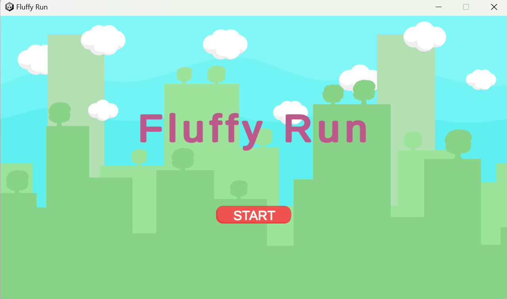
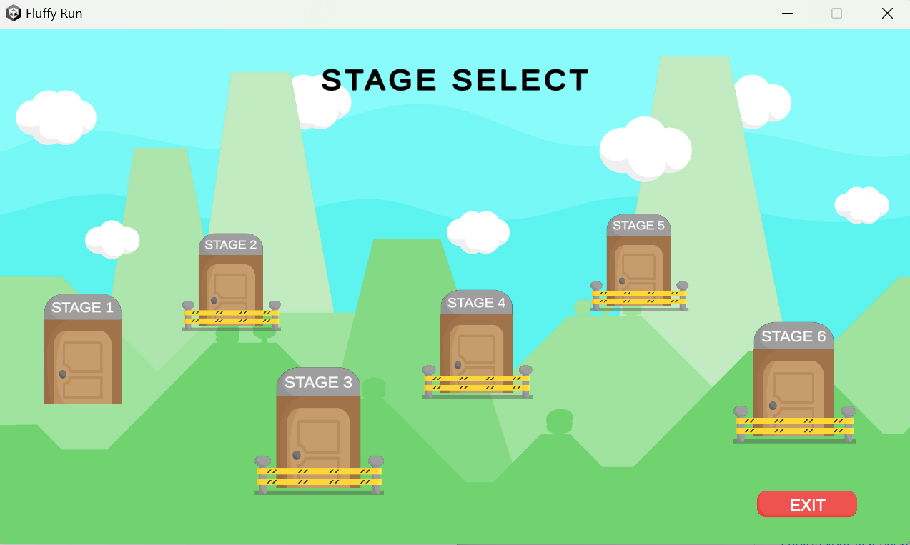
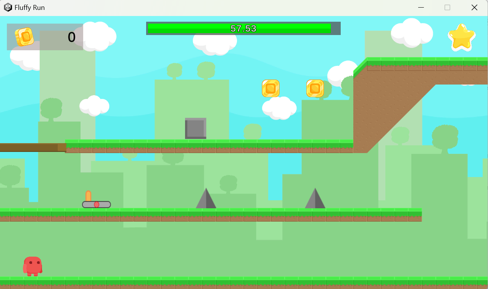
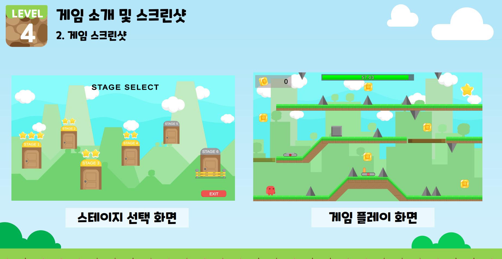
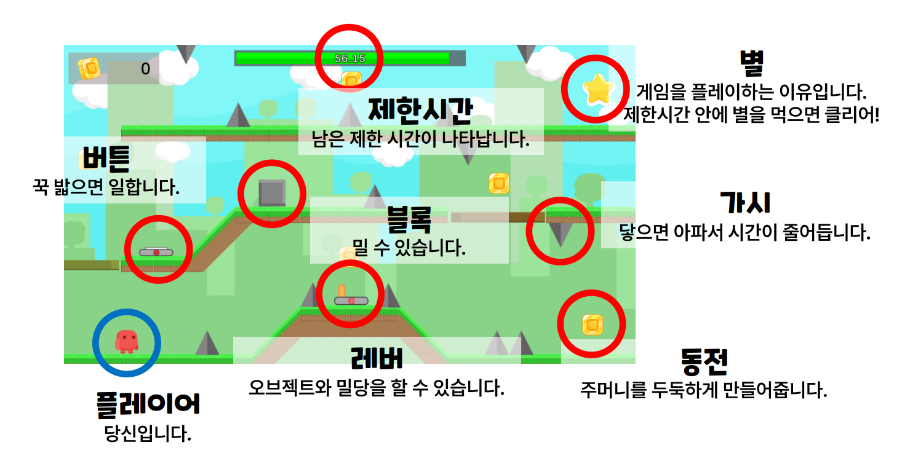

# Fluffy-Run

This game was developed as part of the tutorial project for **Team 3** at _Cien,_ the game development club in Chung-Ang University.

## Introduction

### Development Environment

Unity 2021.3.22f1

#### Game Genre

Puzzle Platform & Stage Format

#### Objective

Provide players with fun and a sense of accomplishment.

#### Core mechanic

The core mechanic revolves around designing various stages with unique configurations and providing players with feedback based on their performance.

#### Game Loop

Clear each stage within a given time limit.
  

## Features

### 1. Player Movement

- Move Left/Right: Arrow Keys (⬅️➡️)
- Jump: `Space Bar`

### 2. Main Interactions

#### Levers

- When the player comes into contact with a lever and presses the ⬆️ arrow key, the lever's ON/OFF state toggles, and the connected platform object moves.

#### Buttons

- When the player or a block touches a button, the connected platform object moves while the button is held down.
- Once released, the platform object returns to its original state.

#### Movable Blocks

- The player can push the blocks to perform necessary actions to clear the game.
    

## Developers

- [Jimin Kim](https://github.com/kjimin0619)
- [Jihun Kim](https://github.com/AppliedAlpha)
- [Minseok Gu](https://github.com/Evturtl)
    

## How to play

#### step 1. Clone the repository to start working with the project.

`git clone https://github.com/your-username/your-repository.git`

Execute the above command in your terminal or command prompt to copy all the files and folders of the project to your current working directory.

#### step 2. Move into the cloned project folder.

#### step 3. Move into the `Build_v1` folder.

#### step 4. Run `Fluffy Run.exe`.

#### step 5. Enjoy it as much as you want!

## Dependency

#### 본 게임은 Unity 무료 에셋을 활용하여 제작되었습니다.

https://assetstore.unity.com/packages/2d/environments/free-platform-game-assets-85838
